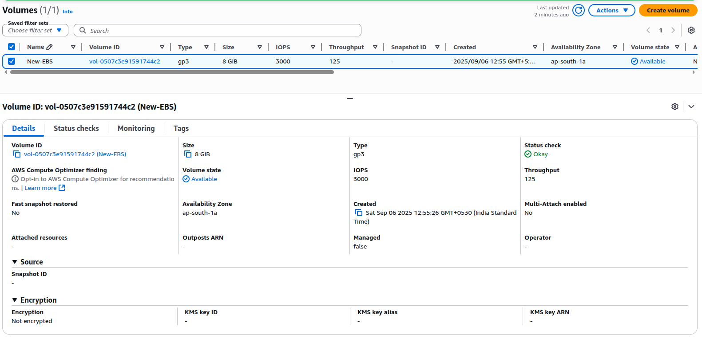
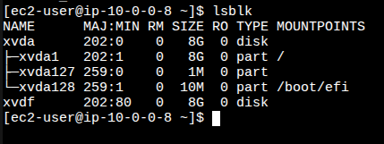
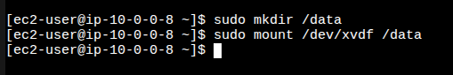
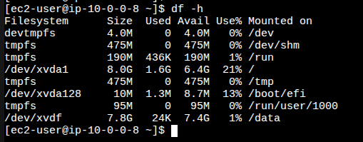

# Project 3: Attach EBS Volume to EC2

## Objective
Attach an additional **EBS volume** to an EC2 instance, format and mount it, then verify using commands.

---

## Steps
1. Create a new EBS volume in the same AZ as your EC2.
2. Attach the volume to the EC2 instance.
3. Connect to EC2 and list block devices:
   ```bash
   lsblk
4. Format the volume (example: ext4):
   ```bash
   sudo mkfs -t ext4 /dev/xvdf
5. Create a mount directory:
   ```bash
   sudo mkdir /data
6. Mount the volume:
   ```bash
   sudo mount /dev/xvdf /data
7. Verify with df -h.

---

## Screenshots

. EBS created in AWS console



. Volume attached to EC2



. Volume formatted and mounted



. df -h output




---

## Key Learnings

. Creating and attaching an EBS volume.
. Formatting and mounting storage.
. Understanding persistent block storage on AWS.

